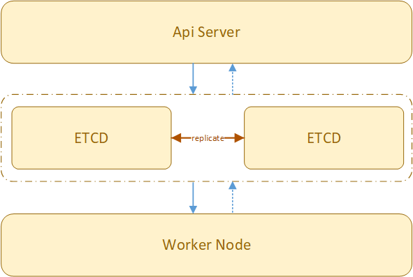
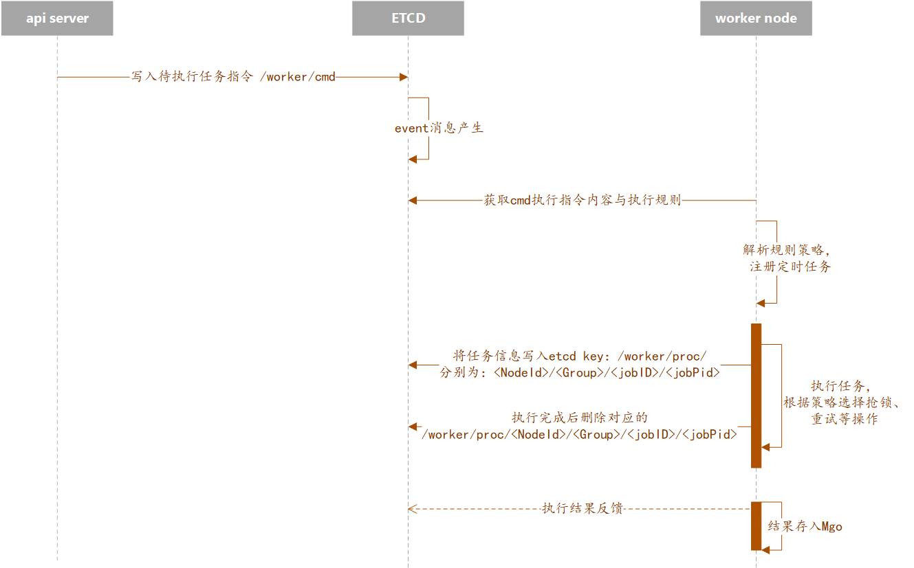
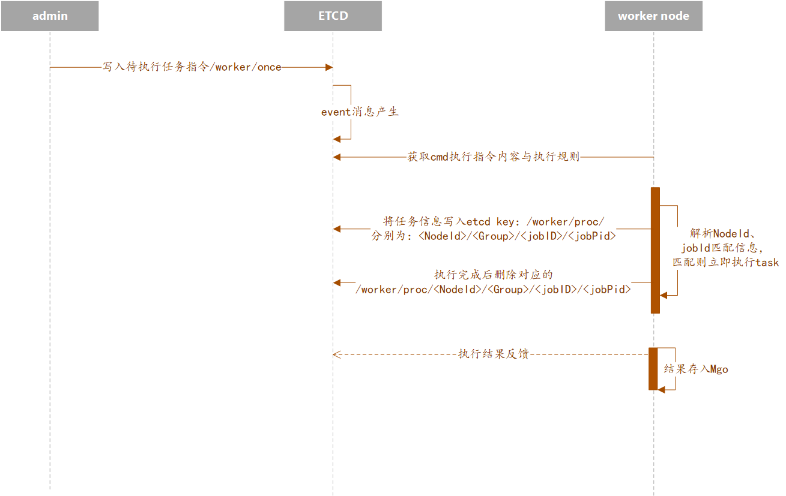
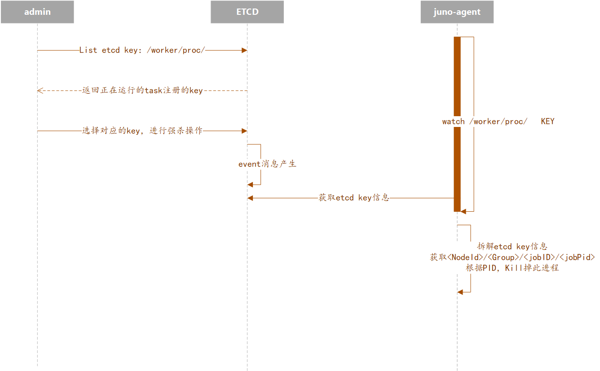

# 定时任务平台

定时任务平台，支持定时任务，一次性定时任务，Bash脚本，Python脚本；执行中的任务进行强制停止等操作。

由于部署多台机器，对于各任务，只需要一台机器进行消费任务，即支持分布式锁。

任务平台用到开源组件ETCD、mongoDB；ETCD作为核心组件，存储任务，编排任务关系，以及为系统提供分布式锁；mongoDB作为存储Log信息组件；

## 参考
- [XXL-JOB](https://www.xuxueli.com/xxl-job/#c%E3%80%81%E8%A7%A6%E5%8F%91%E4%BB%BB%E5%8A%A1)
- [cronsun](https://github.com/shunfei/cronsun)

整体功能设计参考以上两个开源项目。

## 架构设计



## 任务执行时序图

### 添加任务，执行任务



### 立即执行任务




### 强杀任务



## 关键设计

```
"Node": "/worker/node/<Machine_ID>"                         # node节点注册
"Proc": "/worker/proc/<NodeId>/<Group>/<jobID>/<jobPid>"    # 当前执行任务路径
"Cmd": "/worker/cmd/<Group>/<jobID>"                        # cmd 路径
"Once": "/worker/once/group/<jobID>"                        # 马上执行任务路径
"Lock": "/worker/lock/<jobID>"                              # job lock 路径
"Group": "/worker/group/<GroupID>"                          # 节点分组
"Noticer": "/worker/noticer/<NodeId>"                       # 通知
```

## 参数说明

### 任务执行的类型

- **普通任务**：任务会在每一台指定的节点上面执行。
- **单机单进程**：任务会在所有指定的节点中选择其中一个节点来执行，并且*同时有且只有一个*任务进程在跑，直到本次任务执行结束。
- **组级别普通任务**：与**单机单进程**类型不一样的地方是，去除了*同时有且只有一个任务进程在跑*的限制，只要任务调度时间到，就会在某个节点上面开始另一个任务进程。

### 任务类型

当前支持类型：

```json
SHELL、PYTHON
```

### 任务分组

任务分组只是出于方便管理的原因而添加的功能，方便统一查看同一类型任务。

### 超时设置

任务执行超过指定时间时将被强行结束，并且视为任务执行失败。

### 一个节点上面该任务并行数

在同一时间内，同个节点上面最多可以有多少个相同任务进程一起执行。比如当你的任务执行一次需要 5 个小时，但是你设置了间隔 1 小时执行一次，那么大部分时间内都会有 4 个相同任务进程在执行，如果把此参数设置为 2，那么同一时间内只能有最多 2 个相同任务进程。

### 重试 & 重试间隔

- 只在任务失败时用到，设置一个大于 0 的次数，在任务执行失败时，worker 会一直尝试再次执行，直到重试次数达到上限，或者任务执行成功了。
- 重试间隔表示任务失败后，等待多久才开始重新下一次尝试。

